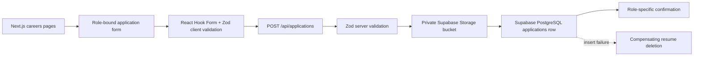

# Hey Grok Careers Application Flow - Working Prototype

An independently built, production-oriented MVP that demonstrates a complete and accessible candidate application journey:

**Careers → Role details → Application → Validation → Resume upload → Submission → Confirmation**

## Problem

During a clean Incognito test of the public [Hey Grok Careers page](https://www.heygrok.ai/careers#openings), the candidate observed that the visible Apply control for the Full-Stack Engineer opening:

- did not produce an observable result when clicked with a mouse;
- received keyboard focus with Tab;
- did not produce an observable result when activated with Enter; and
- was rendered as a native HTML button.

This repository does **not** assert a private implementation detail, framework choice, root cause, or standards-compliance conclusion about the original site.

## Reproduction

The observed behavior was reproduced as follows:

1. Open the public Careers URL in a clean Incognito window.
2. Navigate to the open positions section.
3. Locate the Full-Stack Engineer opening.
4. Activate Apply with a mouse.
5. Reload, press Tab until Apply is focused, and press Enter.
6. Observe that no candidate application journey becomes available in that test environment.
7. Separately eliminate browser-extension console noise as the primary explanation for this candidate-facing behavior.

## Scope

### Observed behavior

The reproduction above describes only externally observable behavior in one clean browser environment.

### Hypothesis

No root-cause hypothesis is required for this prototype, and none is presented as fact. The original control might be affected by event wiring, navigation, state, deployment, or another condition that cannot be determined from the public behavior alone.

### Prototype solution

This project is an original implementation of one possible functional candidate flow. It uses the public Careers experience only as high-level visual inspiration: dark navy surfaces, light typography, orange accents, rounded cards, subtle borders, and spacious responsive layouts.

It does not copy Hey Grok source code, proprietary assets, logos, illustrations, or private implementation details.

## Solution

The prototype gives every job two explicit paths:

- **View role** opens role-specific details.
- **Apply** opens a role-bound application form directly.

The selected role is carried through stable URL slugs and verified server-side against a stable job UUID. Candidates never need to select the role again.

The Full-Stack Engineer flow is:

```text
/careers
  → /careers/full-stack-engineer
  → /careers/full-stack-engineer/apply
  → POST /api/applications
  → /careers/full-stack-engineer/submitted
```

The UI communicates four progress steps: **Role → Details → Application → Submitted**.

## Architecture



### Server/client boundary

- Job pages are server-rendered and validate route slugs.
- The application form is the focused client component.
- Supabase credentials and operations exist only in server modules.
- The API accepts multipart form data, repeats validation, verifies the role pair, uploads the resume, inserts the application, and returns a typed response.
- A database failure after upload triggers best-effort deletion of the newly uploaded object.

## Tech Stack

- **Next.js App Router** — server-first routing, metadata, route handlers, static role pages, and production builds.
- **TypeScript** — strict contracts for jobs, form data, statuses, and API results.
- **Tailwind CSS** — responsive visual composition with a small reusable global component layer.
- **React Hook Form** — accessible form state, inline errors, and efficient client validation.
- **Zod** — shared client/server validation rules.
- **Supabase PostgreSQL** — application persistence, job foreign keys, status enum, and duplicate constraints.
- **Supabase Storage** — private resume storage with MIME and size restrictions.
- **Vitest + Testing Library** — validation, job, component, and request-boundary tests.
- **Playwright** — desktop/mobile candidate-flow, keyboard, validation, and double-submission tests.

## Accessibility

The implementation includes:

- semantic landmarks, headings, lists, definition lists, and native controls;
- direct links for navigation and native buttons for actions;
- a skip link;
- visible `:focus-visible` treatment;
- explicit labels for every form field, including the file input;
- Enter activation for Apply links;
- complete Tab and Shift+Tab navigation using the browser’s native order;
- text and icon/error-prefix feedback rather than color alone;
- `aria-invalid`, `aria-describedby`, `role="alert"`, `role="status"`, and live regions where useful;
- minimum-height action targets;
- reduced-motion support;
- no modal dialog in the core flow, so Escape is not captured or overridden;
- responsive layouts without horizontal overflow at tested desktop and 375 px mobile widths.

The Playwright flow focuses the Full-Stack Engineer Apply link and activates it with Enter before completing the application.

## Security

- The Supabase service-role key is never prefixed with `NEXT_PUBLIC_` and is imported only by server modules.
- The applications table and resume bucket have no public candidate read policy.
- Client validation is repeated server-side.
- The server verifies that submitted job UUID and slug refer to the same active seed record.
- Resumes must have both an allowed extension and MIME type: PDF, DOC, or DOCX.
- Resume size is capped at 5 MB in application validation and Storage configuration.
- Storage paths use generated UUIDs rather than candidate filenames.
- User text is rendered as React text, never raw HTML.
- Duplicate applications are constrained by normalized email plus job ID.
- Database failures trigger best-effort cleanup of the uploaded resume.
- API error messages do not reveal existing application details, storage credentials, or database internals.

For a public deployment, also configure platform-level rate limiting, abuse monitoring, retention/deletion policy, and appropriate privacy/legal copy.

## Local Setup

Requirements:

- Node.js compatible with the versions resolved by `package-lock.json`
- npm
- Optional: Supabase CLI or a Supabase project for real persistence

```bash
git clone <repository-url>
cd hey-grok-careers-prototype
npm install
cp .env.example .env.local
```

For an explicitly non-persistent local demo:

```bash
# .env.local
DEMO_MODE=true

npm run dev
```

Open [http://localhost:3000/careers](http://localhost:3000/careers).

For a production build:

```bash
npm run build
npm start
```

## Environment Variables

```dotenv
# Server-only. Never expose this value through NEXT_PUBLIC_*.
SUPABASE_URL=https://your-project.supabase.co
SUPABASE_SERVICE_ROLE_KEY=your-service-role-key

# Must match the private bucket created by the migration.
SUPABASE_RESUME_BUCKET=resumes

# Local development only. Ignored when both Supabase credentials exist.
DEMO_MODE=true
```

Production should provide Supabase credentials and omit `DEMO_MODE` or set it to `false`.

## Database

The migration is:

```text
supabase/migrations/202610020001_create_applications.sql
```

It creates:

- `application_status`: `SUBMITTED`, `REVIEWING`, `REJECTED`, `HIRED`;
- `jobs`, seeded with the six prototype roles;
- `applications`, with job foreign key and candidate fields;
- a normalized `(job_id, lower(email))` uniqueness rule;
- a private `resumes` Storage bucket with a 5 MB limit and allowlisted MIME types;
- Row Level Security with no public application/resume access policy.

With the Supabase CLI linked to a project:

```bash
supabase db push
```

Alternatively, execute the migration in the Supabase SQL editor. Confirm the bucket remains private before accepting real candidate data.

## Demo Mode

When Supabase credentials are absent and `DEMO_MODE=true`:

- the full UI, validation, file-selection, progress, and confirmation journey remains testable;
- the application page displays a visible **Development demo mode** notice;
- the API validates the candidate data;
- no resume is uploaded;
- no application row is created;
- the confirmation uses a `DEMO-…` reference and explicitly states that nothing was persisted.

If credentials are absent and demo mode is not enabled, submission is disabled and the configuration problem is shown. The project never presents an unconfigured production upload as successful.

## Testing

Run static and unit checks:

```bash
npm run typecheck
npm run lint
npm test
npm run build
```

Run end-to-end tests:

```bash
npm run test:e2e
```

The E2E server starts with explicit demo mode and tests desktop plus a 375×812 mobile viewport.

Covered scenarios include:

- job selection;
- job UUID/slug propagation;
- direct role-bound links;
- missing required fields;
- invalid email;
- invalid URL;
- unsupported file type;
- successful candidate flow;
- upload failure response;
- database failure response;
- keyboard activation of Apply;
- prevention of double submission;
- mobile candidate flow.

## Screenshots

### Careers page


### Role details


### Application form


### Validation


### Resume upload


### Confirmation


## Live Demo

- **Live Careers Page**: [https://hey-grok-careers-prototype.vercel.app/careers](https://hey-grok-careers-prototype.vercel.app/careers)
- **Direct Application Form**: [https://hey-grok-careers-prototype.vercel.app/careers/full-stack-engineer/apply](https://hey-grok-careers-prototype.vercel.app/careers/full-stack-engineer/apply)
- **Deployment Inspector**: [https://vercel.com/nikhiljangid120s-projects/hey-grok-careers-prototype](https://vercel.com/nikhiljangid120s-projects/hey-grok-careers-prototype)

## Repository

**No remote repository was provided or created from this environment.** After publishing:

```bash
git remote add origin <github-repository-url>
git push -u origin main
```

Replace this section with the GitHub URL.

## Disclaimer

This is an independently built candidate prototype based on a publicly observable Careers experience. It is not Hey Grok source code, does not reproduce private implementation details, and is not an official Hey Grok implementation. “Grok Labs” is fictional placeholder branding used only inside the prototype to avoid copying a proprietary logo or brand asset.